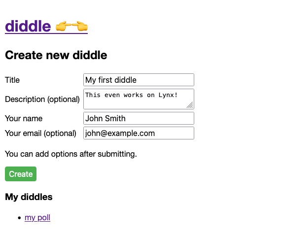
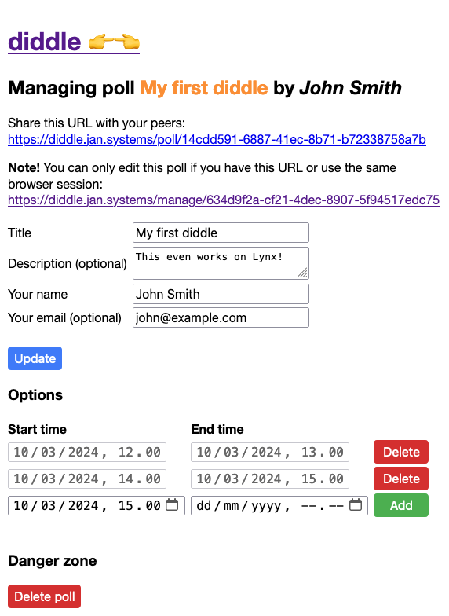
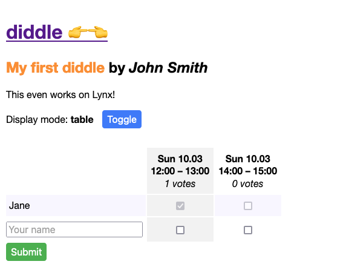
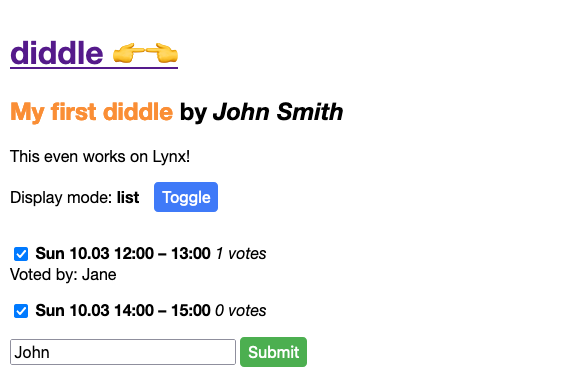

# diddle

Minimalist scheduling. A mobile friendly, fast, self-hosted Doodle alternative.

## Installation

The Diddle app is a traditional Flask web app that uses PostgreSQL for persistence. User settings are stored in HTTP cookies.

Build a container image with `docker compose` (see `compose.yml`):

    docker compose build

or directly with `docker build`:

    docker build -t diddle:latest .

Deploy the image as you see fit.

You can also run the app without containerization:

    pip install -r requirements.txt # install pip dependencies
    touch .env                      # put your env vars here
    python apply_migrations.py      # prepare the database
    gunicorn --bind "0.0.0.0:8000" -w 4 app:app

## Environment variables

| Variable | Description |
| -------- | ----------- |
| BASE_URL | E.g. `diddle.my-server.net`, used as a prefix in dynamically generated links **(required)** |
| DB_PASSWORD | Postgres password **(required)** |
| DB_HOST | Postgres host (default: db) |
| DB_PORT | Postgres port (default: 5432) |
| DB_DATABASE | Postgres database (default: postgres) |
| DB_USER | Postgres user (default: postgres) |
| EMAIL_HOST | SMTP host address |
| EMAIL_PORT | SMTP port |
| EMAIL_HOST_USER | SMTP host user |
| EMAIL_HOST_PASSWORD | SMTP host password |
| EMAIL_USE_TLS | Use TLS with SMTP? |
| EMAIL_MESSAGE_FROM | Email message from header |

`EMAIL_` variables are only required if at least one of them is defined.

## Screenshots

### Front page

### Manage poll page

### Vote page (table mode)

### Vote page (list mode)

## Development

Run Flask in dev mode:

    flask --app app --debug run -p 8000
